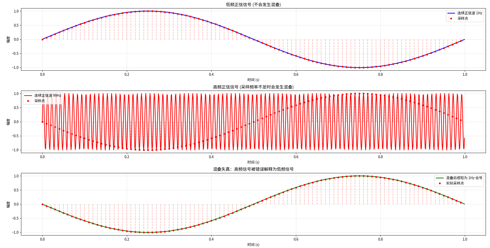
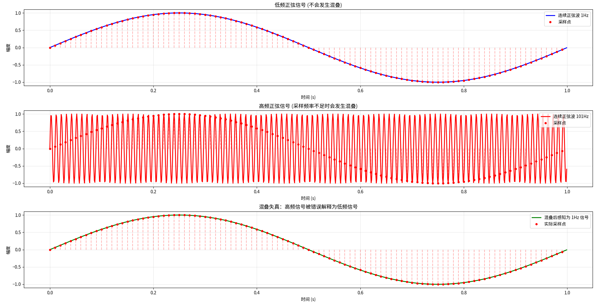

# 走进数字信号处理：一份来自"过来人"的笔记与心得

你好，如果你点开了这个仓库，很可能是曾经或正在被《数字信号处理》课本上那些抽象的公式、突兀的概念搞得头晕眼花，心里想着"这到底有什么用？"。

别担心，我完全理解。一年前的我，就坐在你的位置上。这份仓库，正是我想献给那时自己的"通关攻略"。它**不是教材**，而是我**消化后的笔记、直观的理解和有用的代码**。我会用尽量简单的语言和看得见的例子，帮你捋清主线，建立信心。我们的目标不是满分，而是**真正理解这门学科在做什么，以及如何用它解决实际问题**。

## 先看一个神奇的"错觉"（Aliasing）

理论之前，先看现象。这是理解**采样定理**为何如此重要的第一步。

我写了一段代码，用 **100 Hz 的采样率** 去采集两个不同的信号：
- **图1**：采集一个 **1 Hz** 和一个 **99 Hz** 的正弦波。
- **图2**：采集一个 **1 Hz** 和一个 **101 Hz** 的正弦波。

***图1**：99Hz的信号（蓝色）被100Hz采样后，看起来完全变成了另一个频率的信号（红色圆点）。你能看出它变成了多少Hz吗？*

***图2**：101Hz的信号（蓝色）遭遇了同样的命运。采样点（红色圆点）的连线看起来和某个低频信号一模一样。*

**思考一下**：为什么不同的信号，采样后却都变成了1hz？如果采样系统无法区分它们，会导致什么后果？（这就是"失真"）

这个现象就是**混叠失真**。它直指数字信号处理世界的**第一块基石**：我们必须以超过信号最高频率两倍的速率进行采样，才能完整地保留信息。这就是**奈奎斯特-香农采样定理**。

## 我的学习地图：从困惑到清晰

DSP的知识体系可以梳理成一条比较清晰的路径，这也是本仓库的组织脉络：

# 数字信号处理核心思想

**数字信号处理这门课的核心思想是：如何用计算机（或数字芯片）来处理和分析现实世界中的连续信号（比如声音、图像、电压等）。**

## 一、基础概念：数字化及时域分析
将模拟信号数字化后进行高效处理。关键基础包括：

- **采样定理（数字化前提）**：如何正确地将连续信号转换为离散信号
- **卷积（系统运算核心）**：描述系统如何对输入信号进行响应和处理
- **离散时间信号与系统的时域分析**：在时间域中理解和分析离散信号与系统

## 二、两大数学工具

### 1. 离散时间/离散傅里叶变换（DTFT/DFS/DFT/FFT）
- **目的**：分析信号的频域组成，实现频谱分析
- **关键点**：
  - DTFT：连续频谱分析
  - DFT/FFT：实际计算中使用的离散频谱分析（FFT是DFT的高效算法）

### 2. Z变换
- **目的**：用于系统分析与综合
- **应用**：
  - 滤波器设计与系统表征的主要工具
  - 分析系统稳定性、频率响应等特性

## 三、一个核心应用：数字滤波器设计
设计数字滤波器以处理与改造信号。主要掌握两种滤波器类型：

### IIR滤波器（无限脉冲响应）
- **特点**：利用模拟滤波器设计经验，结构递归
- **优点**：可用较低阶数实现较陡峭的过渡带
- **缺点**：可能不稳定，相位特性非线性

### FIR滤波器（有限脉冲响应）
- **特点**：可严格实现线性相位，结构非递归
- **优点**：总是稳定，相位特性好
- **缺点**：需要较高阶数才能达到与IIR滤波器相似的性能

## 四、终极目标
从信号中提取所需特征信息，完成以下实际任务：

- **滤波**：分离信号中的不同频率成分
- **降噪**：从受干扰信号中提取有用信息
- **检测**：识别信号中的特定模式或事件
- **谱分析**：分析信号的频率组成特性
- **其他应用**：压缩、增强、合成等信号处理任务

## 如何使用本仓库？
- **按顺序阅读**：笔记和代码是按学习路径组织的。
- **动手运行代码**：所有`.py`都配有说明。**自己改参数、看结果**，比读十遍书都管用。
- **把它当作你的第二本笔记**：欢迎提Issue讨论，也欢迎Fork并添加你自己的理解。

## 最后一点鼓励
信号处理是一座山，初见陡峭，但路径清晰。每当你理解一个概念（比如终于搞懂了卷积的物理意义、代数结构、滑动加权平均特性，或者看到自己设计的滤波器成功滤除了噪音），那种豁然开朗的快乐是无与伦比的。

**别被公式吓倒，去追问它背后的直觉。** 让我们一起，把这座山爬过去。
